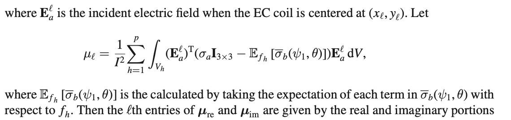

# Running the code
To run the code, run the first 5 cells which initialises all the functions and classes.
- `AII_model` class defines the parameters for defining Bingham distribution and other parameters needed for the forward and inverse model calculations.
- `scan_operation` function runs the forward model and generates ectScan results for a microtexture.
- `calculate_covariance_matrix` function runs the inverse model to retrieve Bingham distribution(cOdf) from ectScan data.

`z_re` and `z_im` are the real and imaginary ectScan values that will act as true data.
User can either provide their own true data. One such example is:
```
# True value
z_re = np.loadtxt("new_green_subsection_real_ect_values.csv", delimiter=',').flatten()
z_im = np.loadtxt("new_green_subsection_imag_ect_values.csv", delimiter=',').flatten()
```
or they can generate random microtexture and use that as true data and try to recover this data by running the inverse model. This can be done by running the following lines:
```
# Run the below code to generate a random microtexture
start = time.time()
aiimodel=AII_model(0.1)
await aiimodel.async_init()
# Uncomment below line to save the data generated in a txt file which can then be used in mtex for plotting pole figures and orientation plots
# It's a good idea to change the value of self.number_of_microstructures to 1, so that it generates just 1 instance of microtexture instead of 30 which saves time
# aiimodel.write_data_to_new_file('recovered_parameters_green_subsection_1_5_0_0_9_0_5.txt')
aiimodel.scan_operation()
z_re = np.real(aiimodel.microstructure_list[1]['ectScan']['zl']).flatten()
z_im = np.imag(aiimodel.microstructure_list[1]['ectScan']['zl']).flatten()
```

# IPython Notebook
The entire notebook contains extensive comments which can help in understanding what different lines of the code is doing.
In the `inverse_modelling.ipynb` file, there are three different examples of inverse model runs:
- Trying to learn only `eta` keeping all other parameters fixed
- Trying to learn all the four parameters together
- Trying to learn only `eta` keeping all other parameters fixed but generating `50` microtextures in every run
If you want to learn some other combination of parameters, then follow the below process:
- Udpate the `AII_model` class to take the specific parameters as input, you can specify multiple parameters from different cODF's here as well
- Update the `simulate_AII_model` function to pass the correct parameters when calling `AII_model` class
- Update the `log_likelihood` function, specifically the following lines to mention the parameters that the model is learning:
  ```
  def log_likelihood(params):
      start_time = time.time()
      # mu_psi, mu_theta , eta, kappa  = params
      parameters = [ 1 , 1.57 , params, 0.15]
      start_time_aiimodel = time.time()
      results = run_async(simulate_AII_model(parameters))
  ```
  ```
  def log_likelihood(params):
    start_time = time.time()
    mu_psi, mu_theta , eta, kappa  = params
    parameters = [mu_psi, mu_theta , eta, kappa]
    start_time_aiimodel = time.time()
    results = run_async(simulate_AII_model(parameters))
  ```
  **NOTE**, If you want to impose prior for the parameters, then you can uncomment the following lines in the `log_likelihood` function:
  ```
  # model.add(smp.uniform(mu_psi, lower=0 , upper=np.pi))
  # model.add(smp.uniform(mu_theta, lower=0 , upper=np.pi/2))
  # model.add(eta_kappa_function(eta,kappa))
  ```
  or you can create your own priors and mention them here.

# Some formulaes
- `zl` is calculated using the following formula:
  
- `mul` is calculated using the following formula:
  
- `gamma` is calculated using the following formula:
  
- `gamma_hat` is calculated using the following formula:
  
More information is provided in the paper [Inverse_problems](./Papers/Homa_2021_Inverse_Problems_37_065004%20(2).pdf)


# MATLAB scripts
- The script called `inverse_model_loading_script` can be used to generate the orientation plot and pole figure plots. It uses the MATLAB tool called mtex to generate the results. The following line plots the orientation plot or microtexture plot:
`plot(ebsd, ebsd.orientations);` and the following line plots the pole figures: `plotPDF(ebsd.orientations,Miller(0,0,1,ebsd.CS),'points','all');` . Input to this script is a microtexture data, an example is provided in the folder named `microtexture.txt`

# Data Generation
- To generate the data for training CycleGAN, codes are provided in the folder Data Generation.
- Function `creating_array_3bingham_distributions` is used for generating 3 codf bingham distributions and `creating_array_2bingham_distributions` is used for generating 2 codf bingham distributions. To generate newer data, run any of the above functions and then run the last cell which generates the input(microtexture data) and output(ectScan data). To run the forward model, the code also needs the two files `Exs_26_26_updated_iterations.npy` and `Eys_26_26_updated_iterations.npy` files which are provided in the same folder.